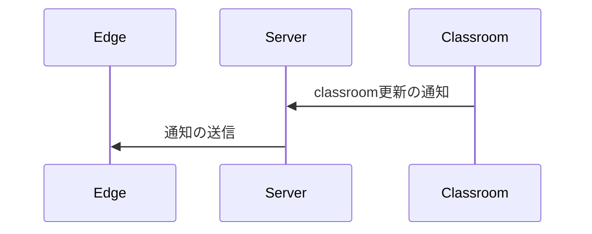
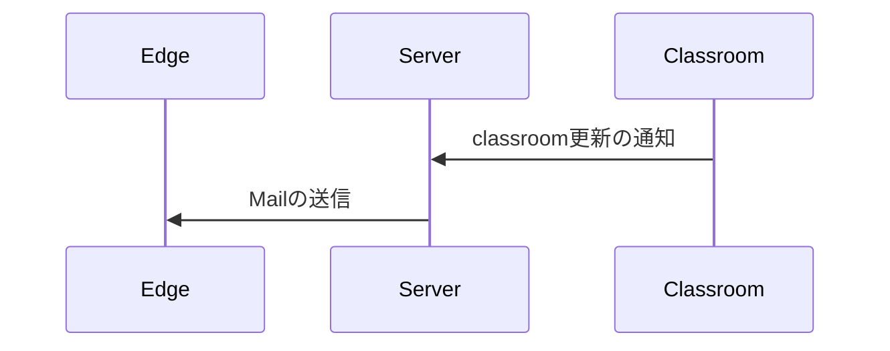
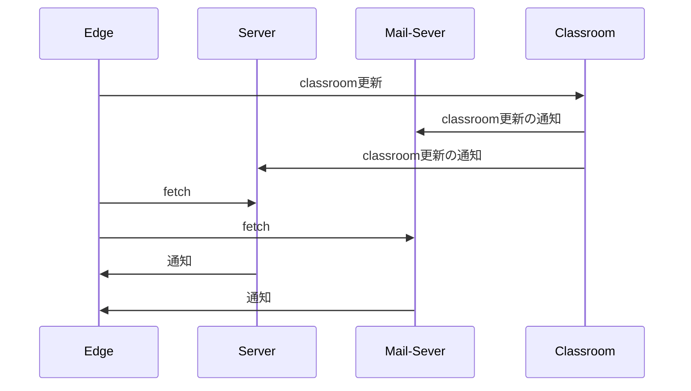
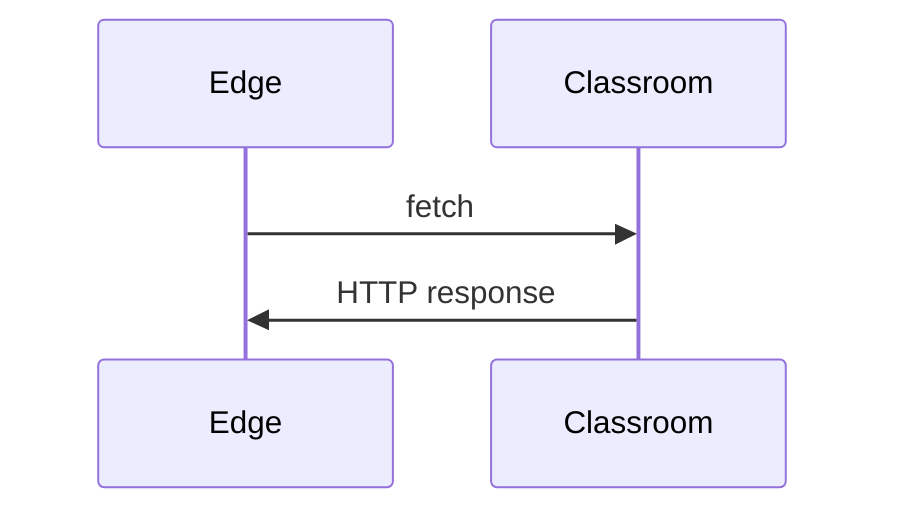
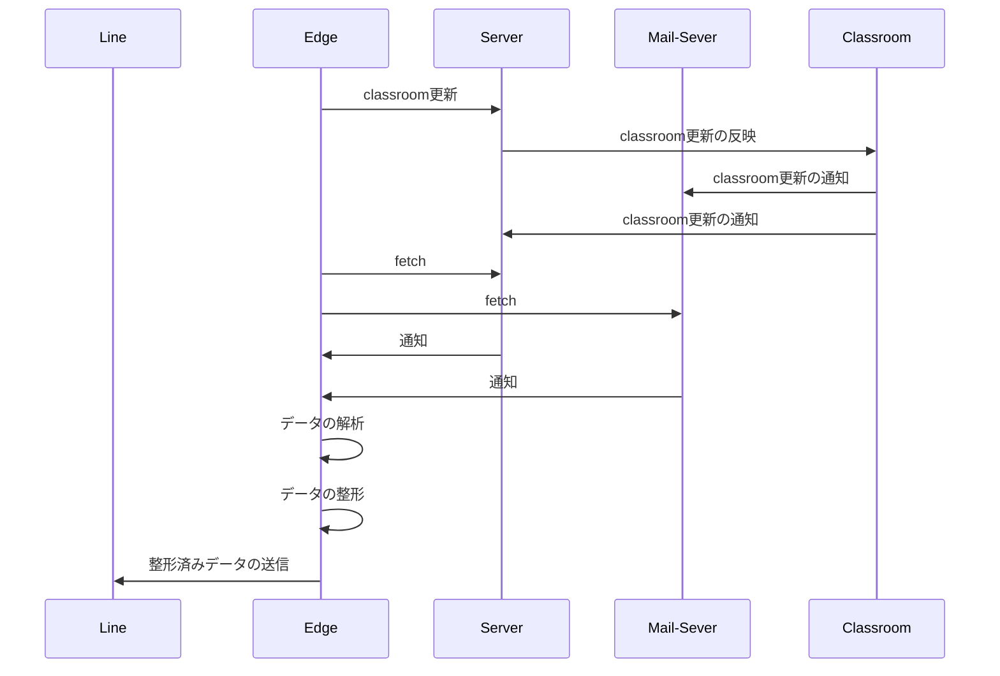
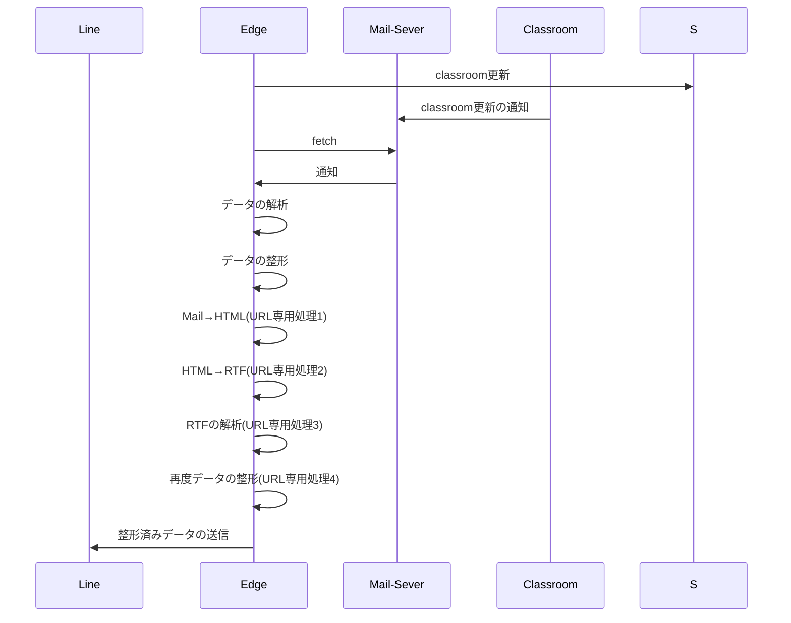

# From-Classroom-To-LINE
<p style="font-color: red;">notionをエクスポートしてるため、思い通りの表記にならない場合があります。</p>
---

# 目次

---

# 概要

---

<aside>
💡

### Ver. 20.0.0

Build Number MjUvMDIxNDAyOjE2.BE

処理時間 およそ90000msec

最大遅延15分(特定の条件下)

</aside>

classroomの投稿者、投稿日付、タイトル、内容を表示させます。

<aside>


### 表示形式

`クラス`

`内容`

`投稿日`

`投稿者`

`url`

</aside>

<aside>


### 表示形式(例)

～～～～

新しいお知らせ


～～～～

～～～～

～～～～

投稿日: 12:50 午後, 1月 21 (JST)、投稿者: 〇〇〇〇

url:[https://classroom.google.com/c/**`classroom_id`**/p/](https://classroom.google.com/c/NjczNjA2MzU1NzY0/p/NzUwMjg1ODcwODQ1)**`post_id`**

</aside>

# Botの仕組み

---

## 基本的な仕組み

classroomの更新は、サーバーを通ってユーザーの端末(Edge)へ通知されます。



また、端末(Edge)への通知は、通常のアプリでの通知(Notification)だけではなく、メールもできます。



まとめると、



データは、必ずEdgeへ向かいます。

APIを使用すると、以下の様になります。



しかし、今回ではAPIは、使えないため、Edge上での処理になります。

説明が長くなりましたが、おおまかな仕組みはこんな感じです。



内部処理を載せるとこんな感じ



<aside>


セキュリティの問題で自動で実行できなかったから、Edgeのセキュリティ下げまくった…

因みに、セキュリティの問題でurlは取得できない…

他の方法を使ってます。

MailをHTMLに変換して、HTMLからRTFに変換します。

RTFでURLを抜き出して、項目を算出して、送信時にURLを整形してから送信しています。

</aside>

# Google ClassroomのURLの仕組み

---

<aside>
💡

### URLの形式

https://classroom.google.com/`{parameter_1}`/`{parameter_2}`/`{parameter_3}`/`{parameter_4}`/`{parameter_5}`

が基本です。

`{parameter_n}`が多くて嫌になりそうですが、通常の場合は、2つで済みます。

https://classroom.google.com/`{1}`/`{2}`/`{3}`/`{4}`/`{5}`

わかりやすく書くとこんな感じ。

`{parameter_n}`とは、parameterは、付随情報、いわば引数である。

</aside>

## 基本のURL

---

### classroomのホームを表示させる。

| `{parameter_1}` |
| --- |
| h |

```
 https://classroom.google.com/h
```

### classroomのアーカイブされたクラスを表示させる。

| `{parameter_1}` | `{parameter_2}` |
| --- | --- |
| h | archived |

```
https://classroom.google.com/h/archived
```

### classroomの設定を表示させる。

| `{parameter_1}` |
| --- |
| s |

```
https://classroom.google.com/s
```

### classroomのクラスを表示させる。

| `{parameter_1}` | `{parameter_2}` |
| --- | --- |
| c | `classroom-id` |
|  | classroom-idは、classroom APIで呼び起こすときに利用するidとは異なります。 |

```
 https://classroom.google.com/c/`{classroom-id}`
```

## 応用のURL

### classroomのカレンダーを表示させる。

| `{parameter_1}` | `{parameter_2}` | `{parameter_3}` | `{parameter_4}` |
| --- | --- | --- | --- |
| calendar | this-week | course | all |
|  | `yyyy-mm-dd` |   | `classroom-id` |
|  | yyyy-mm-dd
%Y-%m-%d

例:2025-01-01 |  | classroom-idは、classroom APIで呼び起こすときに利用するidとは異なります。 |

```
https://classroom.google.com/calendar/`this-week`or`yyyy-MM-dd`/course/`all`or `classroom-id`
```

### classroomのToDoを表示させる。

| `{parameter_1}` | `{parameter_2}` | `{parameter_3}` |
| --- | --- | --- |
| a | not-turned-in | all |
|  | 割り当て済み |  |
|  | missing | `classroom-id` |
|  | 未提出 |  |
|  | turned-in |  |
|  | 完了 |  |

```
https://classroom.google.com/a/`not-turned-in`or`missing`or`turned-in`/`all`or`classroom-id`
```

### classroomの投稿を表示させる。

| `{parameter_1}` | `{parameter_2}` | `{parameter_3}` | `{parameter_4}` | `{parameter_5}` |
| --- | --- | --- | --- | --- |
| c | `classroom-id` | a | `post-id` | details |
|  | classroom-idは、classroom APIで呼び起こすときに利用するidとは異なります。 |  | 投稿id | ※あってもなくても良い。 |

```
https://classroom.google.com/c/`classroom-id`/p/`post-id`/details
```

### classroomの課題を表示させる。

| `{parameter_1}` | `{parameter_2}` | `{parameter_3}` | `{parameter_4}` | `{parameter_5}` |
| --- | --- | --- | --- | --- |
| c | `classroom-id` | a | `issue-id` | details |
|  | classroom-idは、classroom APIで呼び起こすときに利用するidとは異なります。 |  | 課題id | ※あってもなくても良い。 |

```
https://classroom.google.com/c/`classroom-id`/a/`issue-id`/details
```

### classroomの資料を表示させる。

| `{parameter_1}` | `{parameter_2}` | `{parameter_3}` | `{parameter_4}` | `{parameter_5}` |
| --- | --- | --- | --- | --- |
| c | `classroom-id` | a |  `document-id` | details |
|  | classroom-idは、classroom APIで呼び起こすときに利用するidとは異なります。 |  | 資料id | ※あってもなくても良い。 |

```
https://classroom.google.com/c/`classroom-id`/m/`document-id`/details
```

### classroomの授業を表示させる。

| `{parameter_1}` | `{parameter_2}` | `{parameter_3}` | `{parameter_4}` |
| --- | --- | --- | --- |
| w | `classroom-id` | t | all |
|  | classroom-idは、classroom APIで呼び起こすときに利用するidとは異なります。 |  |  |
|  |  | tc | `category-id` |
|  |  | クラス内のカテゴリーを指定 | クラス内のカテゴリーid |

```
https://classroom.google.com/w/`classroom-id`/`t`or`tc`/`all`or`category-id`
```

### classroomのメンバーを表示させる。

| `{parameter_1}` | `{parameter_2}` | `{parameter_3}` |
| --- | --- | --- |
| r | `classroom-id` | `sort-last-name` |
|  | classroom-idは、classroom APIで呼び起こすときに利用するidとは異なります。 | 苗字順 |
|  |  | `sort-frist-name` |
|  |  | 名前順 |

```
https://classroom.google.com/r/`classroom-id`/`sort-last-name`or`sort-first-name`
```